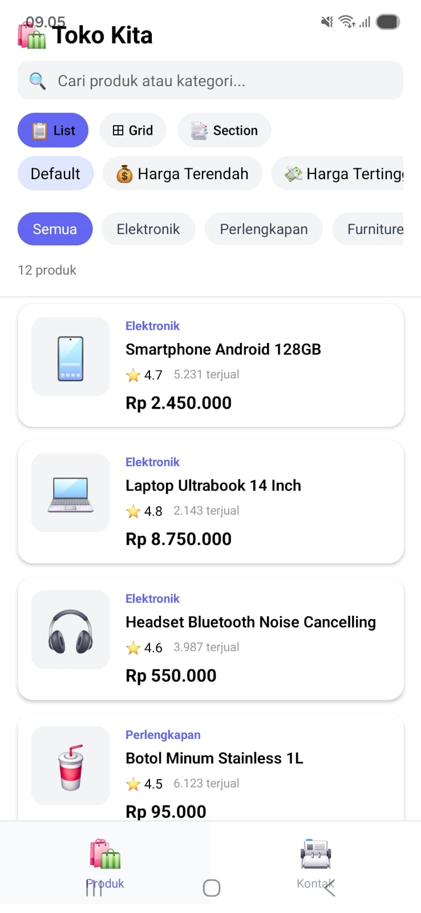
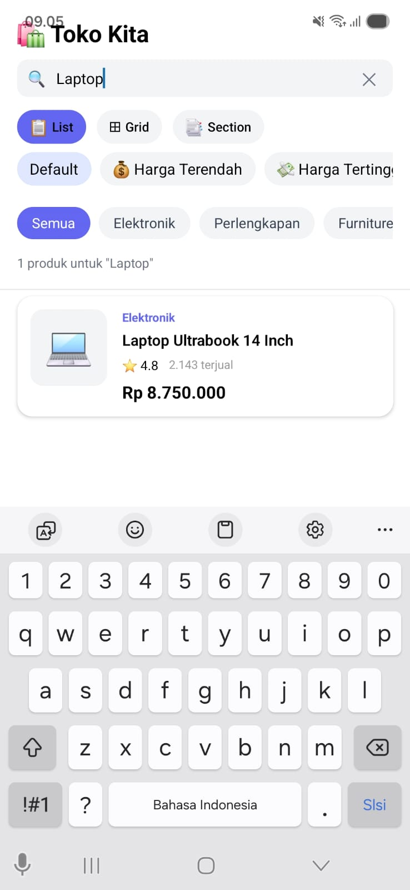
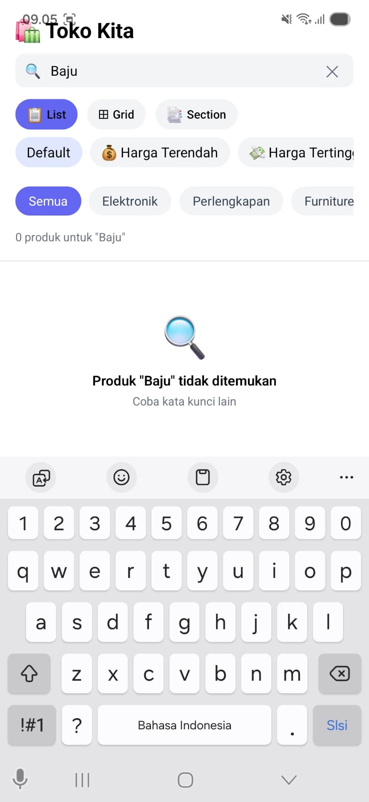

# ShopList App - Pemrograman Mobile Pertemuan 6

## Nama & NIM
- Nama: [Rachel Kris Yanti Hutagalung]
- NIM:  [243303621258]

## Fitur yang Diimplementasikan
- [x] FlatList dengan 12+ produk
- [x] Custom ProductCard component (file terpisah)
- [x] keyExtractor dengan ID unik
- [x] ListEmptyComponent (empty state)
- [x] Search / Filter real-time
- [x] Pull-to-Refresh
- [ ] Filter Kategori (E1) — isi jika dikerjakan
- [ ] Toggle List/Grid View (E2) — isi jika dikerjakan
- [ ] SectionList Mode (E3) — isi jika dikerjakan
- [ ] Sort Produk (E4) — isi jika dikerjakan

## Screenshot
### Tampilan Utama (List Produk)

### Tampilan Search — saat ada hasil

### Tampilan Empty State — saat tidak ada hasil

## Cara Menjalankan
1. Clone repo  : git clone [url-repo-kamu]
2. Install deps: npm install
3. Jalankan    : npx expo start
4. Scan QR Code dengan Expo Go di HP
